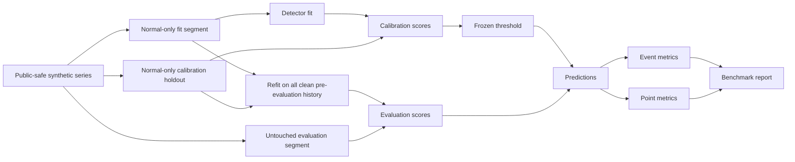

# Time-Series Anomaly Detection Lab

A public-safe, executable benchmark for **time-series anomaly scoring, threshold calibration, and event-level evaluation**.

This repository deliberately focuses on the engineering details that make anomaly-detection experiments trustworthy: temporal leakage, calibration boundaries, causal scoring, event definitions, false alarms, detection delay, and reproducible model comparison.

It uses synthetic data only. It contains **no employer data, flight-test data, internal labels, proprietary thresholds, or private model artifacts**.

## Why this is more than a detector demo

A detector can look excellent if its threshold is selected using the same anomalous period on which it is evaluated. A centered rolling statistic can also accidentally use future observations. Both mistakes create optimistic results without improving the deployed system.

This lab makes those boundaries explicit.



The threshold is frozen **before** the evaluation region is scored.

## Current detector families

### Causal rolling MAD

`CausalRollingMADDetector` compares each sample against a robust median/MAD estimate built only from observations available before that sample.

It is intentionally causal. The test suite verifies that scoring a prefix produces the same values whether or not future samples are later supplied.

### Adaptive EWMA

`AdaptiveEWMADetector` maintains an exponentially weighted baseline and scores the residual before updating its state. Large residuals are clipped during adaptation so one extreme point cannot instantly drag the baseline toward itself.

### PCA window reconstruction

`PCAWindowReconstructionDetector` creates temporal windows, standardizes them from normal training history, learns a low-rank basis with NumPy SVD, and uses reconstruction error as the anomaly score.

This provides a reconstruction-style baseline without pretending it is a neural autoencoder.

## Synthetic benchmark

`generate_synthetic_series` creates a deterministic non-stationary signal with:

- periodic structure;
- changing noise scale;
- isolated spike events;
- a level shift;
- a progressive drift.

The initial calibration region is guaranteed anomaly-free. Injected events occur only after the evaluation boundary.

```text
0 --------------------------------------------------------------> time
|              clean history             |      evaluation       |
| fit segment | threshold holdout         | spikes / shift / drift|
```

This is not intended to be a universal benchmark dataset. It is an executable fixture for testing experiment semantics without exposing private data.

## Threshold calibration

Two calibration strategies are implemented:

- `QuantileCalibrator`: threshold from a high score quantile;
- `RobustSigmaCalibrator`: median plus a configurable robust MAD-derived scale.

Calibration scores come from a later **normal-only holdout**, not from the detector's fit segment and not from the evaluation anomalies.

After calibration, the detector is refit on all clean history available before deployment. The frozen threshold is then used on the untouched evaluation region.

## Evaluation

The lab reports both point-level and event-level behavior.

### Point metrics

- precision;
- recall;
- F1;
- specificity;
- TP / FP / FN / TN.

### Event metrics

- detected events / total events;
- event recall;
- false-positive **runs**, rather than only false-positive points;
- false alarms per 1,000 normal points;
- mean detection delay;
- maximum detection delay;
- optional event-boundary tolerance.

Why event metrics matter: firing 30 times inside one five-minute incident should not necessarily be interpreted the same way as detecting 30 independent incidents.

## Package layout

```text
anomaly_lab/
├── calibration.py   # normal-only threshold estimation
├── cli.py           # reproducible command-line benchmark
├── detectors.py     # causal MAD, adaptive EWMA, PCA reconstruction
├── domain.py        # dataset, event and detection contracts
├── evaluation.py    # point + event metrics
├── experiment.py    # leakage-aware benchmark orchestration
└── synthetic.py     # deterministic public-safe benchmark data

tests/
├── test_detectors.py
├── test_evaluation.py
└── test_experiment.py
```

The original root `demo.py` remains as a convenience entrypoint, but it is no longer where the implementation lives.

## Quick start

```bash
python -m venv .venv
source .venv/bin/activate  # Windows: .venv\Scripts\activate
pip install -e ".[dev]"

anomaly-lab benchmark --samples 5000 --seed 42 --output report.json
```

The old workflow still works:

```bash
python demo.py
```

Alternative robust-score calibration:

```bash
anomaly-lab benchmark \
  --calibration robust-sigma \
  --sigma 4.5 \
  --output robust-report.json
```

## Example report shape

```json
{
  "dataset": "mixed-synthetic-v1",
  "calibration_end": 1750,
  "fit_end": 1137,
  "records": [
    {
      "detector": "causal_rolling_mad",
      "threshold": 0.0,
      "calibration_method": "quantile:0.99500",
      "evaluation": {
        "point": {
          "precision": 0.0,
          "recall": 0.0,
          "f1": 0.0
        },
        "event": {
          "event_recall": 0.0,
          "false_positive_runs": 0,
          "mean_detection_delay": null
        }
      }
    }
  ]
}
```

The numeric values above are structural placeholders, not advertised benchmark results. Run the CLI for the current deterministic results.

## CI quality gates

GitHub Actions verifies:

- editable package installation;
- dependency consistency with `pip check`;
- Ruff linting;
- detector causality/prefix invariance tests;
- point and event metric semantics;
- leakage-aware benchmark orchestration;
- the real CLI benchmark;
- benchmark JSON structure;
- wheel build;
- installation and execution from the built wheel in an isolated environment.

## Design decisions

### Why not tune on labeled evaluation anomalies?

Because the main target use case is unsupervised or weakly supervised anomaly detection. Evaluation labels are for measuring behavior, not selecting a threshold after the fact.

### Why refit after threshold calibration?

The holdout is still clean historical data. Once the threshold has been frozen, using all clean history to establish detector state reflects what a deployed system could legitimately know before the evaluation period begins.

### Why keep simple baselines?

A larger model only matters if it beats well-defined baselines under the same temporal split and threshold policy. Robust statistics and PCA are therefore useful controls, not filler.

### Why no private flight-test examples?

Portfolio code should be independently reproducible. The architecture and evaluation concerns are transferable; proprietary data is not required to demonstrate them.

## Neural-model roadmap

The detector interface is intentionally small enough for future public implementations of:

- dense autoencoders;
- CNN/LSTM reconstruction models;
- causal TCN reconstruction models;
- VAE-family anomaly scoring.

Those models are **roadmap items**, not claimed as implemented in this public branch. Any future neural detector should use the same clean fit/calibration/evaluation boundaries and event-level metrics rather than introducing a separate benchmark path.

## Interview topics this repo supports

This project gives concrete code for discussing:

- unsupervised anomaly detection when labels are scarce;
- threshold calibration without test leakage;
- causal vs centered rolling statistics;
- point anomalies vs collective/event anomalies;
- reconstruction error;
- robust statistics and MAD;
- adaptive baselines under drift;
- class imbalance;
- event-level recall and detection delay;
- false alarms as operational cost;
- fair model comparison under a fixed evaluation protocol.
